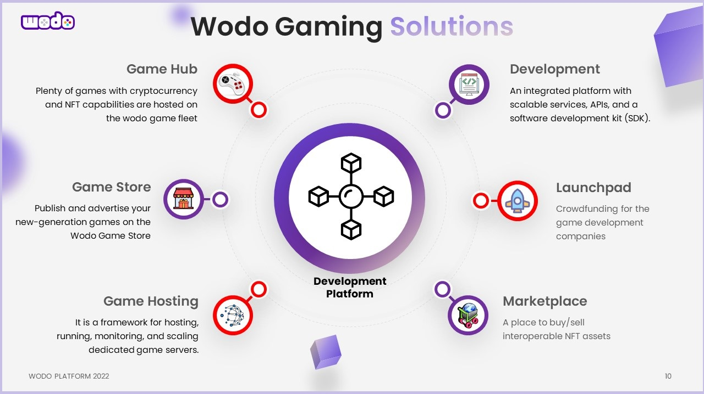
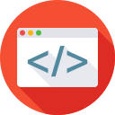
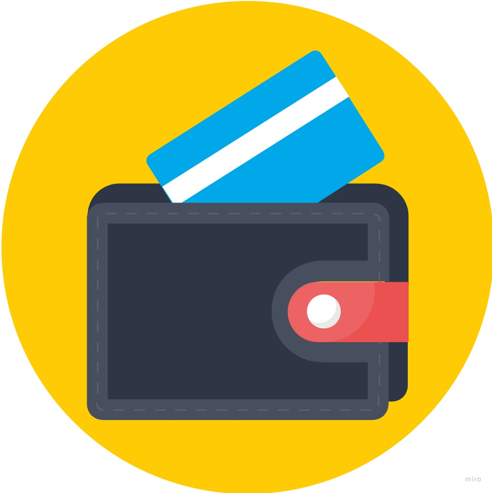
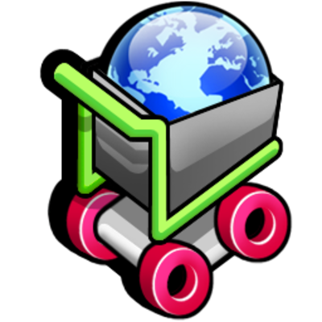
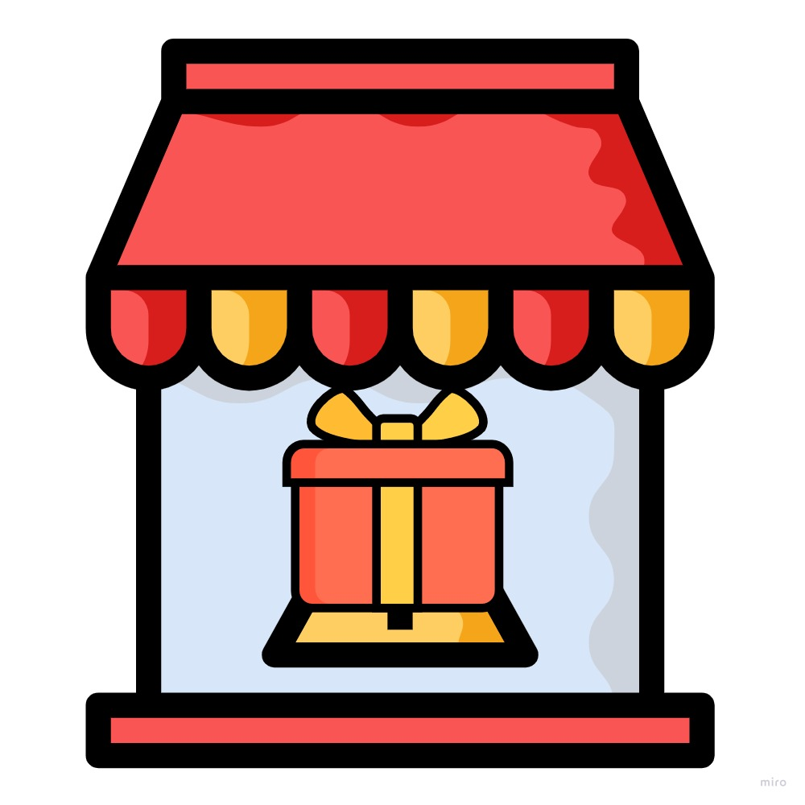

# Intro

Wodo Gaming is an open-source platform where gamers and game developers come together to develop, publish and play next-generation games enriched with blockchain, NFT, and Metaverse technologies in one interoperable, secure, and highly scalable ecosystem. Whether you are a passionate gamer, a freelance game developer, an enterprise gaming company, or Metaverse game designer you can enjoy the novel solutions of Wodo Gaming within an active community. Wodo Ecosystem consists of:&#x20;

* ****[**Wodo Platform:**](ecosystem/platform/fundamentals.md) **** services, APIs, and development kits to manage blockchain, NFT, and metaverse capabilities
* ****[**Wodo Gaming Solutions:**](ecosystem/overview.md) **** Integrated solutions enabling the ecosystem. [Game Hub](ecosystem/gaming-hub.md), Marketplace, Game Store, Launchpad, Game Hosting, Software Development Kits &#x20;
* ****[**Wodoland Game**](ecosystem/wodoland.md)**:** The first MMORPG using cryptocurrencies and NFTs that is designed and built on top of the platform capabilities and fully integrated with the wodo gaming solutions**.**



The metaverse and blockchain technologies unleash a whole new wave of tools, protocols, services that will gradually transform the gaming landscape. Traditional ways of developing, publishing, financing, and playing games will be thoroughly reimagined for a new era where decentralization, democratization, transparency, creativity, interoperability, and community mindset emerge as fundamental pillars.&#x20;


**Wodoland Trailer**


****[**Wodoland**](ecosystem/wodoland.md) **** is the first game design and implementation built on top of the wodo gaming platform using the wodo development kit(SDK). It is a multiplayer MMORPG game in which gamers enjoy a sophisticated world, complete scenarios, and quests, compete with each other, trade/exchange in-game assets, and earn cryptocurrencies and NFT items.

**Wodo Gaming** is now building this new disruptive ecosystem and solutions for empowering game developers/designers to design, develop, publish, and advertise their games and merchandise unique gaming and Metaverse assets, while the community members keep enjoying the online community games and invest/stake in the platform &#x20;

[Game Hub](ecosystem/gaming-hub.md) is an online social arena where wodo community members - players -  play online Wodo games with other community members, join tournaments,  and earn instant cryptocurrencies and NFTs while playing. Plenty of wodo games - developed by Wodo Team -  are hosted on the wodo game servers. Community members can socialize, attend tournaments, play multiplayer wodo games with leaderboards, and discover unlimited opportunities in the gaming ecosystem.&#x20;


**Game Hub**


**Wodo Development Kit** (SDK) and client libraries simplify integration between gaming projects and the Wodo Gaming APIs, blockchain networks so that game developers can rapidly enrich their games with several use cases such as blockchain payment cases, NFT generation as in-game assets, etc.

.jpg>)

### **What's possible with Wodo Gaming?**

It has never been that easy for game developers to enrich their games with blockchain, NFT, and metaverse technologies, and publish/engage their games with an active community that embraces the new era of gaming experience. Here is the simple flow of how a game is empowered with the wodo gaming solutions starting from development to effortless integrations and publishing.


**1-** :bulb: **Idea** - The game

**2-** :rocket: **Launchpad** - Marketing, crowdsourcing, capitalization within an active community. Game token creation, digital economics.

**3-** :gear: **Development** -  Upon/with the platform APIs, services, tools, kits. Add cryptocurrency economics, collectible NFT capabilities, and metaverse integrations to the game.

**4-** :minidisc: **Hosting** - deploy to the game server fleet (optional)

**5-** :question: **Validation** - Publish the game on the game store with limited availability, dry-run for onboarding players (provisioning) to the game, wodo wallet <-> game token integration, engage wodo community members (players) for demo runs

**6-** :arrow\_forward: **Production** **rollout** - General availability \
&#x20;    **6.1-** The game token becomes visible/available in players' wodo wallets&#x20;

&#x20;    **6.2-** Public availability on the game store

&#x20;    **6.3-** Public availability on the gaming hub

&#x20;    **6.4-** Community members start to play the game

**7-** :moneybag: **Merchandising** - Enable trading for the game assets, skins, etc as NFTs in the marketplace.&#x20;

**8-**  :bar\_chart: **Analytics and Insights** - Monitor metrics of the game on the game store and marketplace, get insights about player engagements, in-game economics, merchandising then improve the game.&#x20;

**9-** :unicorn: **Celebrate** the success.&#x20;


****  **Play - Game Hub:** Sign up to Wodo Gaming Portal, play online Wodo games with other community members and earn instant cryptocurrencies and NFTs during your gameplay. Plenty of games with cryptocurrency and NFT capabilities are hosted on the wodo game servers. As a community member, you can socialize, attend tournaments, play multiplayer wodo games, discover unlimited opportunities of the gaming ecosystem. Based on your activity, engagement score on the wodo gaming community, you can collect air-drops and be eligible for intensive and staking programs. [More info.](ecosystem/gaming-hub.md)

**** **Develop - Wodo Gaming Platform & SDK:** Forget about the technological complexities of blockchains and metaverses, start to develop new-generation games with cryptocurrency, NFT, and metaverse capabilities using the platform services & APIs and development kit(SDK) in minutes. _`The platform is the core of the wodo gaming ecosystem`_. It empowers game developers to use simple, interoperable blockchain APIs, NFT APIs, and metaverse APIs for accelerating the game development phases in a unified and secure way. Wodo Gaming also offers a simplified software development kit (SDK) and client libraries for a variety of game development environments such as JavaScript, Unity, Unreal Engine. The client libraries simplify integration between your gaming projects and the Wodo Gaming Platform APIs so that as a game developer, you can rapidly enrich your games with a great variety of use cases such as blockchain payment cases, NFT generation and in-game assets. [More info](ecosystem/platform/services-and-apis/).

 **Design - NFT & Metaverse:** Design unique NFT assets, skins, and interoperable Metaverse components using services and tools provided by Wodo Gaming. The tools help you design and generate your NFTs and Metaverse assets in a standard and interoperable way. You can create in-game assets, skins in your game using Wodo Gaming SDK and APIs then you can seamlessly integrate and share all these NFT assets in the Wodo Gaming Marketplace [More Info](ecosystem/platform/metaverse/)

 **Wodo Wallet - Wodolet:** Manage your crypto assets and NFT items in one single, unified wallet. Wodolet is seamlessly integrated with all solutions of the wodo ecosystem. It connects you to your desired game instantly, [More Info](ecosystem/platform/wodo-wallet.md)

&#x20;****  **Trade - Marketplace:** Design unique NFT assets, skins, and interoperable Metaverse components and sell/buy them in the Wodo Gaming Marketplace. Wodo Gaming provides detailed analytic data and insights so that community members can compare prices and trends over cross marketplace integration capabilities. [More info](ecosystem/marketplace.md).

******Publish - Game Store:** Publish and advertise your new-generation games on the Wodo Game Store. You can reach out to Wodo Gaming community members and onboard them on your game without dealing with the hassle of the crypto world such as setting up wallets etc. The game store provides detailed search capabilities and insights to find, compare and analyze games hosted on the wodo game fleet as well as in the gaming industry. [More info](ecosystem/game-store.md)

******Host: Wodo Game Server Fleet**:  Host your new generation games in the Wodo Game Fleet, let other community members play your game, collect data and insights. The game fleet offers easy deployment and analytic data so that you can easily promote your game and improve the features and capabilities of your game. [More info](ecosystem/game-hosting.md)


Wodo Gaming is one of the blocks in a greater chain [wodo.network](https://wodo.network) that we have been dreaming and building to change our world and shape the future. Stay tuned!


