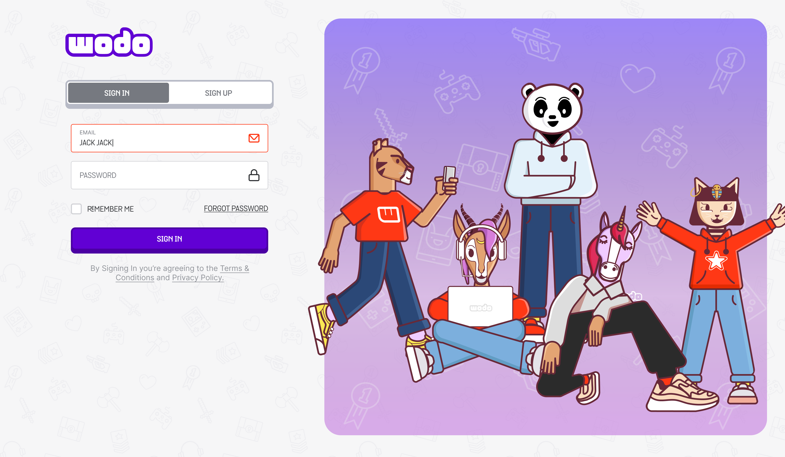

# Game Hub

Game Hub is an online social arena where wodo community members - players -  play online Wodo games with other community members and earn instant cryptocurrencies and NFTs while playing. Plenty of games with cryptocurrency and NFT capabilities are hosted on the wodo game servers. Community members can socialize, attend tournaments, play multiplayer wodo games with leaderboards, and discover unlimited opportunities in the gaming ecosystem.&#x20;


Wdodo Game Hub Development Preview


Based on players' activity, engagement scores on the wodo gaming community, they can collect air-drops and be eligible for intensive and staking programs. The gaming hub is seamlessly connected to the marketplace, game store, and launchpad solutions. It helps players reach all features of the ecosystem from a single point and stay engaged with all activities.

Gaming hub fundamentally leverages two new aspects of the crypto-enabled games:

**Play-to-earn** is a blockchain game model where players play crypto-enabled games and earn assets in the form of tokens or other rewards that can be used in the game or traded in an open market. Players become part of communities and are rewarded with cryptocurrencies while playing.&#x20;

**Play-to-collect** is a new concept in NFT-based games. In this modern online gaming, players can collect their in-game assets and trade them within the game's ecosystem. In-game items and products are stored on a distributed public ledger or blockchain running on a crypto network. Players own globally distributed digital assets that aren't limited to gaming purposes.


Click on the images to zoom in


