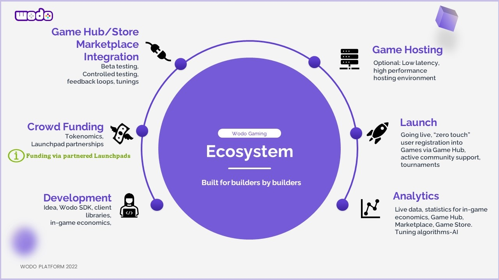

# Launchpad

The conventional fundraising methods are revolutionized with blockchain technologies. Hedge funds are getting obsolete since cryptocurrency crowdfunding mechanisms democratize funding. Our goal is to help the game developers to raise enough capital to crypto-kick-start their projects on a platform providing services in many aspects of the game development tasks such as game store, marketplace, metaverse integrations, crypto-payment integrations, hosting for scalability and a complete set of interoperability tools for several different blockchain technologies. With the ability to design, develop and fundraise, we hope to become the next-generation gaming platform as a complete solution for the next-generation game developers. \

Since we have our like-minded community who are familiar with the value created by gaming, it will be a much more efficient platform to explain your product and its groundbreaking features to your target audience.

### Main features

Launchpad will have the following features:

1. Token generation on your choice of blockchain technology such as AVAX, ETH, BSC or Polkadot
2. Liquidity pool creation and Token Distribution
3. Flexible Token Lock mechanism for specific periods
4. Token sale and collection

### Project review process

Our professional review team will be analyzing every application finically to filter the gems from the scams to protect our community. We are working on the standards of the application process with our legal team for the legitimacy of the fundraising.&#x20;
