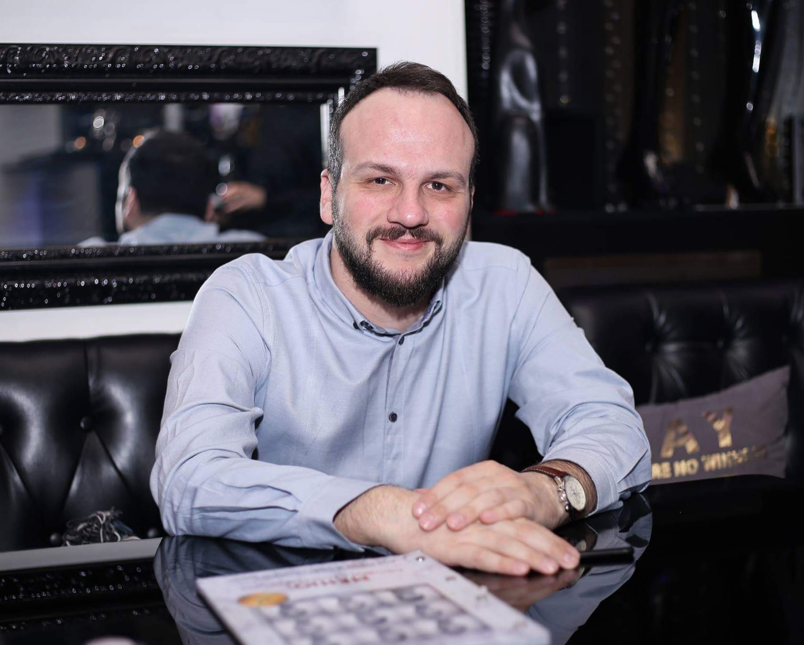
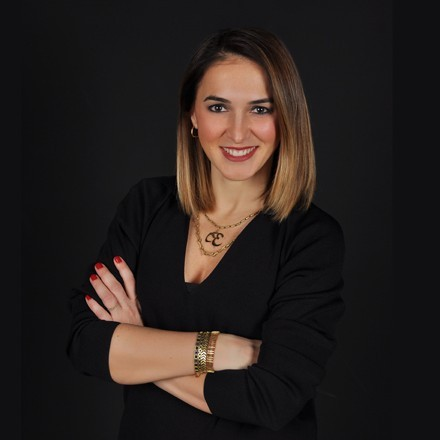
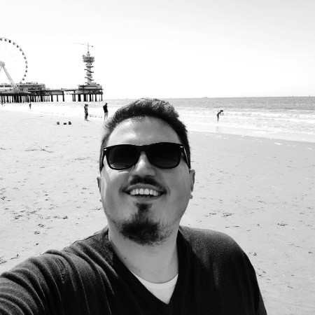

# Meet the Team

## Core Team

### Bekir Dağ

👋 CEO - bekir@wodo.io - :flag\_tr: Istanbul, **Turkey** (GMT+3)



#### Bio

Bekir has been working as a software developer for the last 19 years, started his own web-shop in 2011. He has worked on tens of different projects of various sizes in different industries. He is strongest in product creation since he had several different roles in the product life cycle. He embraces business agility, lean product development, systems thinking, and growth mindset.

### Serhat Tanrıkut

👋 CTO - serhat@wodo.io - :flag\_be: Antwerp, **Belgium** (GMT+1)



#### Bio&#x20;

Serhat has been in the software product development business since 2005. He started his career as a software engineer and walked through different positions in international companies. He has worked for Nokia for 13 years in several leadership, engineering manager roles and moved to another international company in recent years to build cloud-based products. He has been managing international teams delivering complex, high throughput software platforms. He has vast experience in leadership, people management, software product development, software architecture, and cloud technologies.

### Özgür Özmen

👋  CMO  — :books: ozgur@wodo.io — :flag\_ro: Bucharest, **Romania** (GMT+2)



#### Bio

Ozgur worked as a founding assistant professor of international trade departments in several universities of Turkey. His publication record includes many book chapters, articles, proceedings and abstracts of international dimension covering international trade, entrepreneurship, immigration economy & entrepreneurship, EFQM/Total Quality Management and innovation management.

### Salih Genç

👋 Site Reliability & Cloud Infrastructure — :ninja: salih@wodo.io — :flag\_ch: Geneva, **Switzerland** (GMT+1)



#### Bio

Salih has 14 years of total experience as network and cloud infrastructure engineer. He worked with Cisco, Hp/Aruba, Fortinet, and many other vendors. He has vast knowledge of network designing and implementations of network infrastructure, security technologies, and cloud infrastructures.

## Consultants

### Catherine McKimm

👋 Legal Consultant — 💌 catherine@wodo.io — :flag\_au: Sydney, **Australia** (GMT+11)



#### Bio

Catherine has been a practising lawyer for over 40 years with a particular focus on commercial law and litigation. Since January 2014 she has been in-house legal counsel for an Australian based educational software development firm with a global clientele. She specializes in service contracts for the delivery of the company’s learning and assessment products and has a wide range of experience in intellectual property and related issues.

### Yelda Uğur

👋  Human resources — :books: yelda@wodo.io - :flag\_tr: Istanbul, **Turkey**(GMT+2

#### [https://www.linkedin.com/in/yelda-u%C4%9Fur-%C3%B6ztop/](https://www.linkedin.com/in/yelda-u%C4%9Fur-%C3%B6ztop/)

#### Bio

Yelda is an experienced HR professional with a broad background in both commercial and operational environments. I strongly believe in business partnering and a continuous improvement culture. I aim at building strong relationships and identifying opportunities that add value to the business. I am an enthusiastic and creative person, and passionate about people.

### Burak Cansizoglu

👋  Cloud Architecture and DevOps — :books: burak@wodo.io - :flag\_be: Antwerp, **Belgium** (GMT+1)



#### Bio

Burak has more than 14 years of experience in software development. He&#x20;
