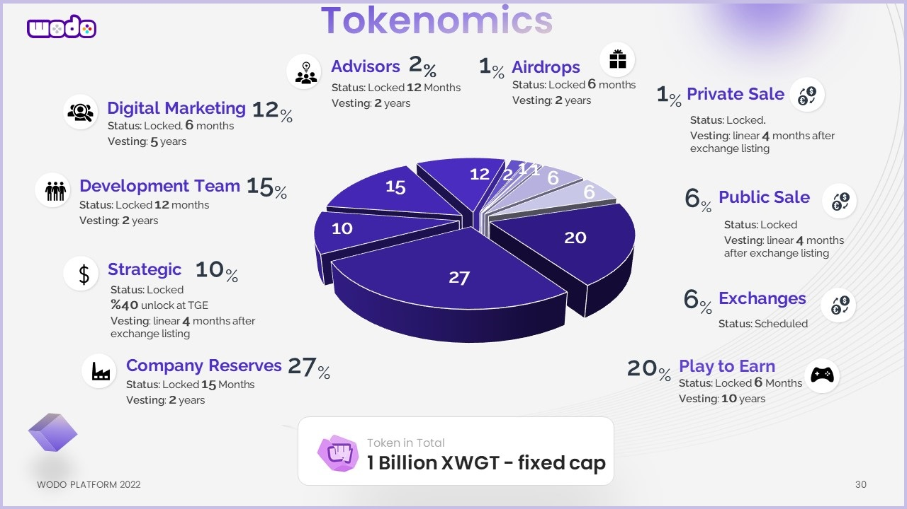

# WODO GAMING TOKEN

**Contract Address:**&#x20;

[0xb2a6DEc1C393f94C3C1d043545175929f80e9292](https://bscscan.com/address/0xb2a6DEc1C393f94C3C1d043545175929f80e9292)

**Ticker:** XWGT

**Decimals:** 18

**Chain:** Binance Smart Chain (BEP20)


The fixed-capped total supply is **1.000.000.000.** &#x20;

**%87** of tokens are locked and will be released over vesting schedules


### **Token Distribution**

* Play to earn: **20%**&#x20;
* Company reserve: **27%**&#x20;
* Team: **15%**&#x20;
* Advisors: **2%**&#x20;
* Private sale: **1%** &#x20;
* Public Sale: **6%** &#x20;
* Exchange Listing: **6%** &#x20;
* Marketing & Social media: **12%**&#x20;
* Liquidity pool: **10%**
* Airdrop: **1%**&#x20;

### Token Wallets

| Allocation                                 | Wallet                                                                                                                                                                                                                                                                                                                                   | Lock                                                                                                                                                                                |
| ------------------------------------------ | ---------------------------------------------------------------------------------------------------------------------------------------------------------------------------------------------------------------------------------------------------------------------------------------------------------------------------------------- | ----------------------------------------------------------------------------------------------------------------------------------------------------------------------------------- |
| :game\_die: Play to earn                   | 
<strong>Address</strong>: <a href="https://bscscan.com/address/0x06FFB27743A561f22DAa9f87999A53610038DA79">0x06FFB27743A561f22DAa9f87999A53610038DA79</a>

<strong>Locked Contract</strong>: <a href="https://bscscan.com/address/0x6e317540f5682b60625aAf548D83D4F917F74Fb1">0xd8C9e7202a7B94f7F87383f368d51fee7Aa05c25</a>
 | 
<strong><code>Unlock Date:</code></strong><code>  01 August , 2022</code> <strong>Vesting:</strong> Released over <strong>10</strong> years once the locking is revoked.
  |
| :briefcase: Company reserve                | 
<strong>Address:</strong> <a href="https://bscscan.com/address/0x1Ab5a251a872A44FdcB85FCa5793E676bD7aB72A">0x1Ab5a251a872A44FdcB85FCa5793E676bD7aB72A</a>

<strong>Locked Contract:</strong> <a href="https://bscscan.com/address/0x6e317540f5682b60625aAf548D83D4F917F74Fb1">0x6e317540f5682b60625aAf548D83D4F917F74Fb1</a>
 | 
<strong><code>Unlock Date:</code></strong><code>  01 April , 2023</code> <strong>Vesting:</strong> Released over <strong>2</strong> years once the locking is revoked.
    |
| :people\_with\_bunny\_ears\_partying: Team | 
<strong>Address:</strong><a href="https://bscscan.com/address/0xD08826eAb186689dDc939571640a46fE01478B5C">0xD08826eAb186689dDc939571640a46fE01478B5C</a>

<strong>Locked Contract:</strong> <a href="https://bscscan.com/address/0x440789bc77B135DB246C434BDf8B3693b85F3CC2">0x440789bc77B135DB246C434BDf8B3693b85F3CC2</a>
  | 
<strong><code>Unlock Date:</code></strong><code>  01 February , 2023</code> <strong>Vesting:</strong> Released over <strong>2</strong> years once the locking is revoked.
 |
| :sound: Marketing & Social media           | 
<strong>Address:</strong><a href="https://bscscan.com/address/0xE7BfefD851F925614A04929C1b834CE337e95C59">0xE7BfefD851F925614A04929C1b834CE337e95C59</a> <strong>Locked Contract:</strong> To be updated
                                                                                                                       | 
<strong><code>Unlock Date:</code></strong><code>  01 August , 2022</code> <strong>Vesting:</strong> Released over <strong>10</strong> years once the locking is revoked.
  |
| :woman\_office\_worker: Advisors           | 
<strong>Address:</strong><a href="https://bscscan.com/address/0x7C7aD0674856ef5C9eD4F1F72533D94e86a5388D">0x7C7aD0674856ef5C9eD4F1F72533D94e86a5388D</a> <strong>Locked Contract:</strong> To be updated
                                                                                                                       | 
<strong><code>Unlock Date:</code></strong><code>  01 February , 2023</code> <strong>Vesting:</strong> Released over <strong>2</strong> years once the locking is revoked.
 |
| :gift: Airdrop                             | 
<strong>Address:</strong><a href="https://bscscan.com/address/0x7C7aD0674856ef5C9eD4F1F72533D94e86a5388D">0x842cb5e69895fbBbe016c95d3b739e0251Ed16C3</a> <strong>Locked Contract:</strong> To be updated
                                                                                                                       | 
<strong><code>Unlock Date:</code></strong><code>  01 August , 2022</code> <strong>Vesting:</strong> Released over <strong>2</strong> years once the locking is revoked.
   |
| :8ball: Liquidity pool                     | 
<strong>Address:</strong><a href="https://bscscan.com/address/0x6316BbD6E9Ad41609c81a72F4ee0C5936dbE117b">0x6316BbD6E9Ad41609c81a72F4ee0C5936dbE117b</a> <strong>Locked Contract:</strong> To be updated
                                                                                                                       | 
<strong><code>Unlock Date:</code></strong><code>  01 February , 2023</code> <strong>Vesting:</strong> none
                                                                |
