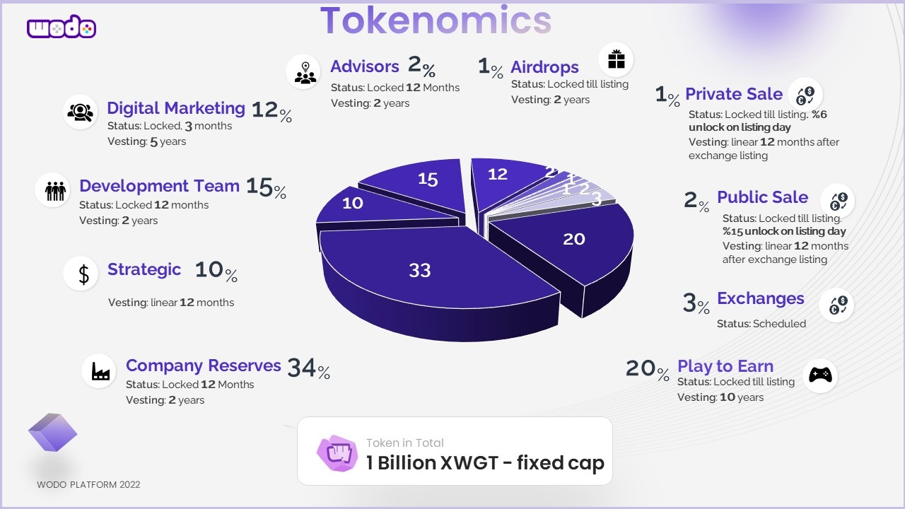

# WODO GAMING TOKEN

**Contract Address:**&#x20;

[0x62D7C4E3566f7f4033fc8e01b4d8e9BBc01c0760](https://bscscan.com/token/0x62D7C4E3566f7f4033fc8e01b4d8e9BBc01c0760)

**Ticker:** XWGT

**Decimals:** 18

**Chain:** Binance Smart Chain (BEP20)

**Total Supply:** 1.000.000.000 ( 1 billion) fixed.

**Private Sale**: %1 - Completed

**Public Sale**: %6.

**Listing**: %6, price: TBD

Wodo Gaming Token (XWGT) is the foundational token used to store value as investment purposes in the wodo gaming ecosystem.


The fixed-capped total supply is **1.000.000.000** (billion) XWGT. **%20** of the total XWGT tokens are reserved for "play to earn" to distribute among Game Hub community members over **10** years. This allocation is locked and released proportionally along with the other distributions.&#x20;


### **Token Distribution**

| Category                  | Allocation | Description                                                      |
| ------------------------- | ---------- | ---------------------------------------------------------------- |
| Play to earn:             | **20%**    | Locked, reserved for play to earn rewards distributions          |
| Company reserve:          | **27%**    | Locked, reserved for company foundation.                         |
| Team                      | **15%**    | Locked, reserved for the  dev team                               |
| Strategic                 | **10%**    | %60 unlocked TGE, %40 locked for liquidity pools and investments |
| Marketing & Social media: | **12%**    | Locked, reserved for marketing plans                             |
| Airdrop                   | **2%**     | Locked, reserved for bounty events                               |
| Advisors                  | **1%**     | Locked, reserved for advisors                                    |
| **Private Sale**          | **1%**     | Locked, 4 months linear vesting at exchange listing,             |
| **Public Sale**           | **6%**     | Locked, 4 months linear vesting at exchange listing,             |
| **Exhange Listing**       | **6%**     | Reserved for exchange listing                                    |

### Allocation Accounts and Vesting Wallets

| Allocation                                       | Wallet                                                                                                                                                                                                       | Lock                                                                                                                                                                                                                                         |
| ------------------------------------------------ | ------------------------------------------------------------------------------------------------------------------------------------------------------------------------------------------------------------ | -------------------------------------------------------------------------------------------------------------------------------------------------------------------------------------------------------------------------------------------- |
| :game\_die: Play to earn - %20                   | 
<strong>Address</strong>: <a href="https://bscscan.com/address/0x06FFB27743A561f22DAa9f87999A53610038DA79">0x06FFB27743A561f22DAa9f87999A53610038DA79</a>

<strong>Locked Contract</strong>: TBU
 | 
<strong><code>Lock: 6</code></strong><code> Months</code> <strong>Vesting:</strong> Released over <strong>10</strong> years once the locking is revoked.
                                                                           |
| :briefcase: Company reserve - %27                | 
<strong>Address:</strong> <a href="https://bscscan.com/address/0x1Ab5a251a872A44FdcB85FCa5793E676bD7aB72A">0x1Ab5a251a872A44FdcB85FCa5793E676bD7aB72A</a>

<strong>Locked Contract:</strong> TBU
 | 
<strong><code>Lock: 15</code></strong><code>Months</code> <strong>Vesting:</strong> Released over <strong>2</strong> years once the locking is revoked.
                                                                            |
| :people\_with\_bunny\_ears\_partying: Team - %15 | 
<strong>Address:</strong><a href="https://bscscan.com/address/0xD08826eAb186689dDc939571640a46fE01478B5C">0xD08826eAb186689dDc939571640a46fE01478B5C</a>

<strong>Locked Contract:</strong> TBU
  | 
<strong><code>Lock: 12</code></strong><code>Months</code> <strong>Vesting:</strong> Released over <strong>2</strong> years once the locking is revoked.
                                                                            |
| :sound: Marketing & Social media - %12           | 
<strong>Address:</strong><a href="https://bscscan.com/address/0xE7BfefD851F925614A04929C1b834CE337e95C59">0xE7BfefD851F925614A04929C1b834CE337e95C59</a> <strong>Locked Contract:</strong> TBU
     | 
<strong><code>Lock: 6</code></strong><code> Months</code> <strong>Vesting:</strong> Released over <strong>5</strong> years once the locking is revoked.
                                                                            |
| :woman\_office\_worker: Advisors - %2            | 
<strong>Address:</strong><a href="https://bscscan.com/address/0x7C7aD0674856ef5C9eD4F1F72533D94e86a5388D">0x7C7aD0674856ef5C9eD4F1F72533D94e86a5388D</a> <strong>Locked Contract:</strong> TBU
     | 
<strong><code>Lock: 12</code></strong><code> Months</code> <strong>Vesting:</strong> Released over <strong>2</strong> years once the locking is revoked.
                                                                           |
| :gift: Airdrop - %1                              | 
<strong>Address:</strong><a href="https://bscscan.com/address/0x7C7aD0674856ef5C9eD4F1F72533D94e86a5388D">0x842cb5e69895fbBbe016c95d3b739e0251Ed16C3</a> <strong>Locked Contract:</strong> TBU
     | 
<strong><code>Lock: 6</code></strong><code>Months</code> <strong>Vesting:</strong> Released over <strong>2</strong> years once the locking is revoked.
                                                                             |
| :8ball: Strategic - %10                          | 
<strong>Address:</strong><a href="https://bscscan.com/address/0x6316BbD6E9Ad41609c81a72F4ee0C5936dbE117b">0x6316BbD6E9Ad41609c81a72F4ee0C5936dbE117b</a> <strong>Locked Contract:</strong> TBU
     | 
<strong><code>%40</code></strong><code> free up, </code><strong><code>%60</code></strong><code> locked </code><strong><code></code></strong><code> at </code><strong><code>TGE,</code></strong> <strong>Vesting:</strong> 4 Months
 |

### Circulated Tokens Timeline

Locked XWGT tokens are locked and will be released based on precise vesting schedules in order to protect our investors and keep token valuation steady over the course of time.&#x20;

Blue bars depict the amount of total circulated(unlocked) tokens over quarters and years in the graph below.&#x20;

`Please click on the image to zoom in.`

