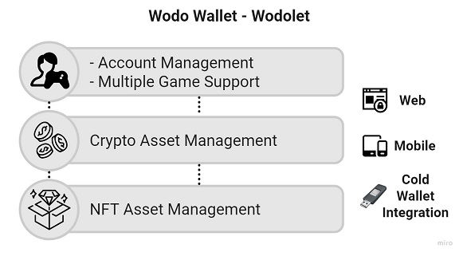

# Whitepaper

You can download the pdf version of the white paper at the link below





### **Simplifying  Blockchain, NFT, and Metaverse adoption in The Gaming Ecosystem**

**Abstract**

`The purpose of this paper is to describe the main challenges of adopting blockchain, NFT, and metaverse technologies in the gaming ecosystem and provide solutions addressing these challenges through a holistic approach.`

_Disclosure: The information described in this paper is preliminary and subject to change at any time. Furthermore, this paper may contain "forward-looking statements."_

## 1. Introduction

Blockchains became popular because of the success of [Bitcoin](http://bitcoin.org/bitcoin.pdf), the master cryptocurrency launched in 2008. Many people associate blockchains primarily with trading and investment. After the implementation of the first blockchain -Bitcoin [\[1\]](whitepaper.md#5.-references)- the cryptocurrency landscape has undergone tremendous changes. The application of blockchain now extends far beyond financial and investment commodities. Today, many modern blockchains have fully programmable features -**smart contracts** -, which enable developers to build almost any application. These applications run on specific blockchains, such as Ethereum and Avalanche, and use their own currency units named "tokens" to grant users ownership and income streams in the application. Tokens are alternate virtual currencies circulating inside the on-chain applications and ultimately can be converted /traded to actual coins of the back-bone blockchains.&#x20;

Non-fungible tokens (NFTs) are blockchain-based records that uniquely represent digital media items, including videos, music, game assets, in-game items, avatars, skins, etc., as collectible art pieces. In simple terms, NFT is a unit of data stored on a blockchain that certifies the uniqueness and ownership of digital assets. NFTs contain documentation of their history and origin and can have code attached to do almost anything, including selling, loaning; a popular feature is a code that ensures that the original creator receives royalties from secondary sales. NFTs are crucial building blocks for a new wave of [Web 3.0](https://en.wikipedia.org/wiki/Web\_3.0) services that radically alter the economics of the internet and gaming industry by redistributing value and control from tech giants back to users, developers, designers, and small firms.

The years ahead will show that blockchains can support more applications beyond money and finance. A cluster of new blockchain technologies, including tokens and NFTs, will dramatically transform digital economics in the gaming industry.

> **Harvard Business Review** - No matter what the context, there’s a strong possibility that blockchain will affect your business. The very big question is when. [\[2\]](whitepaper.md#5.-references) &#x20;

The next emerging technology that is transforming the gaming ecosystem is the Metaverse. The Metaverse is a set of interconnected, experiential, 3D virtual worlds where people located anywhere can socialize in real-time to form a persistent, user-owned internet economy spanning the digital and physical world. While the Metaverse can feel like an impossibly "far away" concept in the eyes of many beholders, the truth is that we are already living among proto-metaverses, and the future will be here before we're truly ready for it. The decentralized infrastructure and NFTs will be/are the central part of the metaverse platforms. Therefore it is vital to realize the impact of the big threes - blockchains, NFTs, the Metaverse - in the gaming ecosystem altogether.

Undoubtedly crypto metaverses games are immersive virtual worlds with unlimited social and financial potential in the gaming ecosystem. Their use of blockchain infrastructure enables the metaverse games to tap into the broader crypto economy, making virtual items exchangeable for real economic value beyond the confines of the Metaverse. The Metaverse, or metaworlds, are aligned to become a central element in the next phase of blockchain games on the internet.

> **Ryan Gill** - Crucible CEO & Co-founder: If the web developers are the architects of the internet as we know (Web 2.0), then the game developers are the architects of the Metaverse - Web 3.0. [\[3\]](whitepaper.md#5.-references)

So this document guides the readers through to understand the most significant challenges and respective solution proposals that help adopt these cutting-edge technologies, the big threes, in the gaming ecosystem. Ultimately, as [Wodo Gaming](https://wodo.io), we'd like to share our vision for the technology evolution, focusing on the implications for gaming.

## 2. Overview

Blockchain is often compared to the internet, but people knew how to use the internet intuitively when it first became publicly available. Blockchains have an impressive technological background where technology comes before distinct use, so it still has many obstacles to realization and mass adoption. Public blockchains are complex, and they are still relatively slow, rely on cryptocurrencies for value transfer. The adoption of blockchain in the gaming ecosystem has yet to be realized to its full potential, despite existing proof-of-concept. NFTs, cryptocurrency, and blockchain games have been tough to understand for developers, and players often have no clue how to use things like cryptocurrency wallets and NFTs. Today, we have thousands of cryptocurrencies, and it is challenging to ground or collect them in a single place.

The metaverse influence in the gaming ecosystem often incorporates multiple key elements such as in-game engagement, innovation in tech, game design, NFTs and digital ownership, interoperability for digital assets, avatars, digital identities, and interoperability of different meta-world games. Metaverse gaming inherits the challenges of blockchains since it is built around decentralized blockchain technologies.

All these challenges can be examined under the following categories:

#### **Complexity**

An average person with standard knowledge can't grasp the concept behind cryptocurrency and NFTs, how it works, or how it could fit into gaming. It is not easy to onboard gamers onto the crypto & Metaverse enabled games without simplifying fundamental features of blockchains such as wallet creation, asset management, and NFT management. Gamers should have unified and simplified tools, services to be able to

* Manage their crypto assets, NFT assets, and identities (metaverse avatars)&#x20;
* Trade/exchange their assets and NFTs instantly over multiple marketplaces.
* Play multiple blockchain/metaverse games using the same identity, crypto wallet, and NFT assets
* Follow trends in blockchain/metaverse gaming, upcoming games, popular games, etc.

For developers and gaming companies, the situation is even more challenging. To incorporate the tech stack into their games, they need to understand the internal dynamics of blockchains, NFT networks, and fundamental metaverse functionalities. Dealing with such complexity is cumbersome. There is no one-size-fits-all solution yet. The complexity is extended to maintenance, scalability, privacy, data governance fields beyond development practices. Overall, the tech depth becomes a true burden for gaming companies.

#### **Fragmentation**

There are over 2000 different types of cryptocurrencies in use. Every day, more and more cryptocurrencies and NFT networks are added to the list, making it difficult for everyone to learn and understand. People get confused about where to start and which cryptocurrencies and NFT networks have the best features and benefits. The same issue is yet to stand out in the metaverse landscape. As inevitably appealed in other technology adoption phases, the fragmentation of approaches within certain jurisdictions is indisputable and unsurprising. Fragmented systems motivate individuals and communities to take the technology forward. In contrast, a significant industry problem remains: the lack of harmonization in technical standards and regulation threatens mass adoption and progress of blockchain and metaverse technologies in the gaming ecosystem.

#### **Interoperability**&#x20;

Currently, no solutions, frameworks have been defined yet to build in-game economies and metaverses in a way that is conducive to interoperability. Major platforms don't support common standards, which means it is incredibly cumbersome for developers to implement games, content, and software that runs across multiple platforms, thus making it difficult to reach a maximum audience. Current solutions for designing and developing crypto-enabled applications, NFTs, metaverse games lack interoperability and standards. Consequently, these technologies do not integrate well via a unified framework for the gaming ecosystem. This integration and interoperable solutions are necessary to work around some constraints, such as scalability of transactions and ergonomics, using and merchandising NFTs assets and avatars across multiple games and metaverses. Ultimately developers should have tools, frameworks, and APIs that help them implement their use cases running on multiple blockchains, NFT networks, marketplaces, and metaverse platforms in a compatible way.

#### **Standards**

No standardization exists regarding what blockchain protocols or metaverse protocols to use. Mass concurrency and interoperability are immature, but new protocols are being developed, and more is yet to come. Hopefully, new standards can also open doors to equal participation, likely to be driven by communities altogether. As our world becomes increasingly networked and interconnected, having open standards, protocols, and formats will allow for the free flow of information, tools, and services, the efficient upgrading and maintenance of digital spaces, and the standardization of toolsets and capabilities in the gaming ecosystem.

> **Tim Sweeney**, Epic Game's founder, recently told Bloomberg that the Metaverse was a multitrillion-dollar opportunity and that companies like his were in a race to get to a billion users to set the Metaverse's **standards** for the future.

**Data & Security**

Data privacy and security have been a long-running concern for users of any online application. Submerging into blockchain and metaverse gaming will require evolving security methods to an entirely new level. This will require building new forms of personal data, privacy protection, and identity management that will ensure the safety of one's identity in the virtual world.&#x20;

## 3. Solution

Wodo Gaming Ecosystem brings gamers and game developers together to address all these aforementioned challenges and accelerate the adoption of blockchains, NFT, and metaverse technologies in the gaming industry. We believe that gaming communities will collaborate continuously, develop ever-increasingly new-generation games upon blockchains, metaverses and genuinely play these games to enjoy, learn, adapt, and advance for a better gaming experience.

Wodo Gaming Ecosystem is built around **the wodo gaming platform**, **wodo gaming solutions**, and **player & developer communities**. Developers and players leverage the novel solutions that rely on the unique capabilities of the wodo gaming platform. The platform facilitates a collaborative environment where game developers enrich their games with interoperable blockchain, NFT, metaverse capabilities and publish their games to game players through the novel solutions and tools of the ecosystem. In contrast, game players onboard themselves quickly on the gaming hub without dealing with cumbersome details of the cryptocurrencies and NFTs, socialize with community members, play various new-generation games and ultimately earn cryptocurrencies and NFT assets.

**Key benefits for game players:**

* An interactive community - _**Gaming Hub**_: Become a member, socialize, engage, and get rewarded.&#x20;
* Play to earn, play to collect - _**Gaming Hub**_: Numerous crypto-enabled games to enjoy and win cryptocurrencies and NFTs.
* Multipurpose Wallet - _**Wodolet**_: Manage your crypto assets and NFTs in a secure, ergonomic, and practical way using a single tool.
* Metaverse identity management - _**Digital Passport**_: step into the metaverse gaming, create your digital identity.
* Discover new and trending games - _**Game Store**_: Access all new-generation games, follow trends and ratings.
* Store and trade NFTs assets - _**Marketplace**_: Trade NFT assets, get recommendations and insights.
* Invest in new gaming projects - _**Launchpad**_: Follow up on the latest game projects and become an investor.

**Key benefits for game developers:**

* An interactive developer community - ** **_**Gaming Hub**_: Developers collaborate with game players and other developers to collect feedback and follow up on tech discussions.
* Fully equipped platform to simplify and accelerate development - _**Platform**_: The platform is the core of the wodo gaming ecosystem. It empowers developers to use simple, interoperable, blockchain, NFT, and metaverse APIs for accelerating the development cycles in a unified, interoperable and secure way.
* Development kit and client libraries - _**SDK**_: A toolset to make developers' life easier during development phases. Tiny libraries running inside your game, connect your game to the platform APIs
* Interoperability and standards - _**Platform**_: APIs services implemented based on the interoperability-first mindset standards.
* Early steps for metaverse gaming - _**Platform**_: APIs supporting multiple metaverse gaming platforms and early metaverse standards.
* Crowdsource and launch new games - _**LaunchPad**_: Ability to organize investment campaigns for crowdsourcing, automated flows to create custom tokens, and wodo platform integrations&#x20;
* API integration to the marketplace - _**Marketplace**_: APIs for tailoring games and the marketplace directly, ability to programmatically publish in-game NFTs assets to the marketplace, discovering analytic data for trends and insights
* Publish and advertise games - _**Game Store**_: Fully featured game store to publish games. APIs for exposing statistics and insights about games
* Deploy and host games - _**Game Hosting**_: Performant game server fleet to host games with global availability.

Wodo Gaming Ecosystem consists of interconnected technical and logical entities tailored to fundamental values.

Further details about the wodo gaming platform and the wodo gaming solutions are explained in the following sections.

### **3.1. Wodo Gaming Platform**

The platform is the core of the wodo gaming ecosystem. It empowers game developers to use simple, interoperable blockchain APIs, NFT APIs, and metaverse APIs for accelerating the game development phases in a unified and secure way.&#x20;

API is the acronym for **Application Programming Interface**, which allows two applications to interact without knowing how they're implemented. APIs hide complex implementation details from their consumers and expose understandable and straightforward functionality to the outer world. Furthermore, the API-driven approach allows API owners to change backend API implementations without breaking end-to-end business models or functionalities. API consumers can keep using the same API methods with no change. The following diagram illustrates how the wodo gaming platform leverages the key API-driven design aspects.

Concerning the scenario in the diagram above, game developers do not need to know in detail how the "sendTransaction(..)" method is executed to process and finalize a blockchain transaction among the blockchain nodes. Blockchain API, as a platform service, handles this heavy-lifting task. Game developers focus on understanding how they can conveniently use the method, or Blockchain API, in the request/response paradigm within their codebase. If there is a change, or a new functionality available on APIs, adding a new blockchain network to the supported blockchains list in the sample use-case above, perhaps game developers incorporate the changes into their codebase with a minor tweak. As a theoretical example, game developers need to adjust the "blockchainName" parameter sufficiently in the request for the "sendTransaction" method call to use the new blockchain network as a new cryptocurrency supported in their games.

The gaming platform consists of API-driven services, a software development kit (SDK), and additional services.&#x20;

The primary purpose of the gaming platform is to simplify the complexity of blockchain and metaverse technologies in a secure, interoperable, and scalable way. It is globally available and offers a wide range of APIs, services, and solutions for game developers and gaming companies. The blockchain and metaverse technologies keep evolving; many new standards will be determined. The gaming platform will remain compatible and keep offering a seamless development experience to developers by incorporating all new standards and enhancements of the technical landscape  &#x20;

#### 3.1.1 **Platform** APIs

Platform APIs and services are the primary foundations of the wodo gaming platform. They provide a consistent feature set and unique capabilities to meet game developers' development challenges and technical demands while developers implement their in-game use-cases on the blockchain networks, NFT networks, and metaverse platforms. As the blockchain and metaverse industries advance and look for further growth opportunities, keeping a seamless developer experience is paramount for the game development industry. To achieve that, the platform offers an extensible and pluggable architecture that allows developers to add new capabilities in a standard way. Platform's API definitions and plugin implementation guides are publicly available for wodo developer communities.&#x20;

**Blockchain APIs**

Blockchain APIs define a standard way of any blockchain integration into the wodo platform. Developers can implement and plug any blockchain integration into the platform as _blockchain engine implementations_. A blockchain engine consists of concentrated blockchain integration implementation conforming to the platform's API standards and other additional functionalities that are needed to make end-to-end integration work. Out of the box, the wodo platform has a variety of blockchain integration implementations such as Nano, Banano, Avalanche. Once blockchain engines are integrated into the wodo platform, all functionality and capabilities are made available to the public world (developers, game developers, 3rd party companies) via public APIs of the wodo platform.

**NFT APIs**

NFTs are built around the idea that digital content can be scarce just like physical assets and can therefore be globally owned and traded. NFT attributes rely on blockchain technology to verify the provenance of digital content that a given work of an asset is, in fact, the original and not a replica. Gamers prefer games where they can collect NFTs and own a part of that universe. NFT compatibility will be an attractive and must-have feature for game developers.&#x20;

The Platform NFT APIs define a standard way of NFT network integration into the wodo platform. Game developers can use the NFT APIs to create digital game content and in-game assets, skins avatars as collectible NFT items over their preferred NFT network. Community developers can implement and plug any kind of NFT network integration as NFT engine implementations. Out of the box, the wodo platform has a variety of NFT integration implementations. The API definitions also adhere to the industry standards. Once NFT engines are implemented and integrated into the wodo platform, all functionality and capabilities are made available to the public world (developers, game developers, 3rd party companies) via public APIs of the wodo platform.&#x20;

**Metaverse APIs**

The Platform Metaverse APIs define a standard way of any metaverse integration, standardization into the wodo platform. In a similar fashion to the other APIs, game developers can leverage the Metaverse APIs to implement different use cases on their preferred metaverse platforms. Developers can implement and plug any metaverse integration as metaverse engine implementations. The Metaverse technology is still in very early phases. The metaverse will be an immersive open network for gaming, social, and enterprise collaboration. It is built collaboratively by many organizations where openness and interoperability are the core values of this ecosystem. Platform's metaverse APIs conform to open metaverse standards and will evolve alongside the Metaverse technology.

**Notification Service**

Notifications serve an essential function in software and product design. As suggested by [Jakob Nielsen](https://www.nngroup.com/articles/author/jakob-nielsen/), "T_he system should always keep users informed about what is going on, through appropriate feedback within a reasonable time_”.[\[5\]](whitepaper.md#5.-references)  The notification services are the foundational building blocks of the platform to keep users - game developers - informed about operations they have initiated or topics they are interested in. Most of the operations are executed in asynchronous patterns in the wodo gaming platform. Game developers subscribe to specific topics and get notified about specific events. This capability enables game developers to build efficient use-cases in their games and implement their codes fluently. Sample use cases:

* Create In-Game Asset as NFT: Developers can send the platform NFT API a request to mint an NFT item. This operation takes time, therefore it occurs in an **asynchronous** way. The gaming platform notifies the game when the NFT is generated on the selected blockchain. Game developers implement a code piece that processes the notification and takes follow-up actions in their game code.
* Subscribe to Games: When a player downloads a game from the game store or directly subscribes to an online game, the player needs to be provisioned and onboarded to the selected game. Game developers need to implement player provisioning logic in their game codes.  In order to handle this business use case, game developers implement a code piece that subscribes to notifications on the "new player" topic of the gaming platform. Upon receiving a notification, they can run their code to process new player information.&#x20;

**Other Services**

The gaming platform includes a wide spectrum of other services in order to run all the solutions in a comprehensive way. The other services serve different types of purposes, from security to data persistency.

#### 3.1.2 SDK and Client Libraries

Wodo Gaming SDK is a toolset to make game developers' life easier during game development. The SDK resides in development environments and provides game developers with&#x20;

* _Integrated development environment (IDE) plugins:_ Game developers can use their favorite development tool (IDE) with the Wodo SDK plugins. It simplifies and accelerates coding practices.
* _Client Libraries:_ Tiny, effictive client libraries that connect gaming runtime to the wodo platform APIs with a few lines of code.  Game developers embed the client libraries in their preferred platform, such as unity engine, unreal engine or javascript, then get started to implement blockchain and metaverse uses cases in minutes.  &#x20;
* _Easy Testing:_ Game developers can test their use cases against the mocked platform APIS and test nets of their preferred blockchain network or metaverse platforms prior to production roll-out.
* _Multi Environment Support:_  The SDK supports multiple run time environments -  mobile, web and virtual reality - as well as multiple game development platforms - Unity Engine, Unreal Engine, JavaScript.

### 3.2. Wodo Wallet - Wodolet

Wodolet is a multi-purpose, ultra-secure software wallet implementation that allows users to manage crypto assets and NFT items in one single, unified way. Wodolet is seamlessly integrated with all solutions of the wodo ecosystem. It connects players to new generation games instantly.

****

### **3.3 Digital Identities**

Metaverses need standard identity management similar to passports, to grant access to different services and metaverse platforms. Digital identities seem like customized avatars in the metaverses. But they are more than fancy avatars. A digital identity is a persistent interoperable, and decentralized digital entity often referred to as Self Sovereign Identity (SSI). The movement aims to protect user privacy through decentralized identifiers (DIDs), which digital passports can be thought of as.

Through digital identity standards and tools, people will re-create themself in metaverses. They will keep control of their identity management. The digital identity implementations will rely on blockchain technologies. The digital identity solution of the wodo gaming will adhere to the standards and evolve over the course of time.

### 3.4 Game Hub

Game Hub is an online social arena where wodo community members - players -  play online Wodo games with other community members and earn instant cryptocurrencies and NFTs while playing. Plenty of games with cryptocurrency and NFT capabilities are hosted on the wodo game servers. Community members can socialize, attend tournaments, play multiplayer wodo games with leaderboards, and discover unlimited opportunities in the gaming ecosystem. Based on players' activity, engagement scores on the wodo gaming community, they can collect air-drops and be eligible for intensive and staking programs. The gaming hub is seamlessly connected to the marketplace, game store, and launchpad solutions. It helps players reach all features of the ecosystem from a single point and stay engaged with all activities.&#x20;

Gaming hub fundamentally leverages two new aspects of the crypto-enabled games:

**Play-to-earn** is a blockchain game model where players play crypto-enabled games and earn assets in the form of tokens or other rewards that can be used in the game or traded in an open market. Players become part of communities and are rewarded with cryptocurrencies while playing.&#x20;

**Play-to-collect** is a new concept in NFT-based games. In this modern online gaming, players can collect their in-game assets and trade them within the game's ecosystem. In-game items and products are stored on a distributed public ledger or blockchain running on a crypto network. Players own globally distributed digital assets that aren't limited to gaming purposes.

### 3.5 Marketplace

Pre-blockchain, players invested billions of dollars into digital items in other online games without a tangible way to benefit from it beyond occasional gameplay advantages; the content remains locked behind their account because their purchase is just a lease or licensing agreement capability to transfer or sell. And while other secondary marketplaces have existed in the form of gray and black markets, players who participate are exposed to unsafe transactions and scams.

Decentralized ownership - **Non-Fungible Tokens(NFT)** - is sowing the seeds of a new era of gaming, where players will be able to own, collect, and trade their items across games and outside of games. Game players have their assets and NFTs stored on the blockchain for life. This unique capability has led to the emergence of another platform - **marketplace** - that enables gamers, game developers, and designers to preserve and trade NFT assets.

Wodo gaming marketplace extends fundamental features of streamlined marketplaces and augments additional feature set for specif needs of the gaming ecosystem. The augmented features work seamlessly with other services and APIs in the platform.&#x20;

Developers leverage the marketplace services and APIs to tune in-game dynamics and use cases. Analytic data and recommendation services provide developers with insights, trends, and user interests. Users/players trade their NFT assets via Web and Mobile interfaces.&#x20;

### 3.6 Game Launchpad

The conventional fundraising methods are revolutionized with blockchain technologies. Hedge funds are getting obsolete since cryptocurrency crowdfunding mechanisms democratize funding. Our goal is to help the game developers to raise enough capital to crypto-kick-start their projects on a platform providing services in many aspects of the game development tasks such as a game store, marketplace, metaverse integrations, crypto-payment integrations, hosting for scalability and a complete set of interoperability tools for several different blockchain technologies. With the ability to design, develop and fundraise, we hope to become the next-generation gaming platform as a complete solution for the next-generation game developers.&#x20;

Since we have our like-minded community familiar with the value created by gaming, it will be a much more efficient platform to explain your product and its groundbreaking features to your target audience.

Launchpad will have the following features:

* Token generation on your choice of blockchain technology such as AVAX, ETH, BSC or Polkadot
* Liquidity pool creation and Token Distribution
* Flexible Token Lock mechanism for specific periods
* Token sale and collection

### 3.7 Game Store

Wodo game store is an interactive space where game players discover a broad spectrum of blockchain and metaverse games. It is a digital collection of blockchain, NFT, and metaverse games approved for use by Wodo Gaming. Players browse, purchase, review, and rate games through the game store's web or mobile interfaces.

The game store operators officially approve the games listed on the game store. The games are reviewed carefully to ensure that they conform to the wodo gaming criteria and guidelines considering security, digital economic models, blockchain, Metaverse and NFT compatibilities, etc.


When a wodo community member - a game player - purchases a game on the game store, the platform initiates the "player onboarding" flow for the game purchased. The player info is sent to the backend game system; the game token is activated and made visible in the player's crypto wallet. Once the game's installation is completed, the player instantly gets ready to enjoy the game. The platform drives complicated tasks related to blockchains and cryptocurrencies behind the scene.


Game developers publish their games through a well-defined automated flow. Upon publishing a game, the game store services start to collect analytic data about the game based on several aspects such as ratings, reviews, searches, and downloads. The collected data is compiled, interpreted, and exposed to game developers as insights over a web interface.

### 3.8 Game **Hosting**

As game developers look for further growth opportunities to build and publish their blockchain and metaverse-enabled games rapidly, another critical challenge arises to address. Game developers need a smooth way to deploy and host their new generation games without compromising low latency, responsive gaming experience. This challenge is not a big obstacle for giant gaming companies and platforms since they have enough resources to overcome the heavy-lifting of game server deployment and management.

The gaming industry will be decentralized and democratized more and more with the influence of blockchains. This change will lead to more independent game developers and gaming startups building games in the gaming ecosystem. Thus it is a fundamental pillar for game developers to have a smooth game deployment flow and hosting environment that provides global availability, low latency, easy management, elasticity, scalability, and insights with data. To fulfill this gap, we designed the game server fleet. It is a framework for hosting, running, monitoring, and scaling dedicated game servers. All crypto-enabled games available to the wodo community members through the wodo gaming hub are deployed, hosted, and managed by the game server fleet.

The game server fleet offers dedicated game server capability that enables a reliable, stable, and low latency deployment environment for a smooth gaming experience. Game developers deliver responsive multiplayer gaming anywhere in the world.

## 4. Conclusion

 Each time there has been a new introduction of technology to the gaming industry, we witness an expansion. Blockchain and Metaverse technologies are at our doorsteps. They transform the gaming ecosystem permanently. Wodo Gaming solutions are designed to make blockchains, NFTs and Metaverse fundamentals easy to use and accessible for game developers and players. Our vision is to accelerate the transformation of the gaming ecosystem to a new era built around Blockchain and Metaverse technologies and to establish a community as a reference point through curating simple, practical, innovative solutions  __ &#x20;

## 5. References

1. Bitcoin Whitepaper by Satoshi Nakamoto - [http://bitcoin.org/bitcoin.pdf](whitepaper.md#simplifying-blockchain-nft-and-metaverse-adoption-in-the-gaming-ecosystem)&#x20;
2. The Truth About Blockchain by [Marco Iansiti](https://hbr.org/search?term=marco%20iansiti) and [Karim R. Lakhani](https://hbr.org/search?term=karim%20r.%20lakhani) - [https://hbr.org/2017/01/the-truth-about-blockchain](https://hbr.org/2017/01/the-truth-about-blockchain)
3. The Metaverse Is Here. Are You Ready?  by RaqeellE Zuzarte - [https://www.mediavillage.com/article/the-metaverse-is-here-are-you-ready/print/](https://www.mediavillage.com/article/the-metaverse-is-here-are-you-ready/print/)
4. Metaverse Is a Multitrillion-Dollar Opportunity By Sohe Kim - [https://www.bloomberg.com/news/articles/2021-11-17/metaverse-is-a-multitrillion-dollar-opportunity-epic-ceo-says](https://www.bloomberg.com/news/articles/2021-11-17/metaverse-is-a-multitrillion-dollar-opportunity-epic-ceo-says)
5. 10 Usability Heuristics for User Interface Design by Jakob Nielsen  [https://www.nngroup.com/articles/ten-usability-heuristics/](https://www.nngroup.com/articles/ten-usability-heuristics/)&#x20;

## 6. Glossary

**Blockchain**

A blockchain is a decentralized, distributed, and frequently public digital ledger consisting of records called _blocks_ that are used to record transactions across many computers so that any involved block cannot be altered retroactively without the alteration of all subsequent blocks. It is the databases that represent an immutable shared history.

**Bitcoin**

Bitcoin (₿) is a decentralized [digital currency](https://en.wikipedia.org/wiki/Digital\_currency), without a central bank or single administrator, that can be sent from user to user on the peer-to-peer bitcoin network without the need for intermediaries. Transactions are verified by network nodes through [cryptography](https://en.wikipedia.org/wiki/Cryptography) and recorded in a public distributed ledger called a [blockchain](https://en.wikipedia.org/wiki/Blockchain).

**Non-Fungible Tokens - NFTs**

A non-fungible token (NFT) is a unique and non-interchangeable unit of data stored on a [blockchain](https://en.wikipedia.org/wiki/Blockchain), a form of digital ledger. NFTs can be associated with reproducible digital files such as photos, videos, and audio. NFTs use a digital ledger to provide a public certificate of authenticity or proof of ownership but do not restrict the sharing or copying of the underlying digital files.

**Game Token**

A crypto token is a virtual currency token or a denomination of a cryptocurrency. It represents a tradable asset or utility that resides on its own blockchain and allows the holder to use it for investment or economic purposes. Crypto tokens can represent an investor's stake in the company or they can serve an economic purpose.&#x20;

#### **Metaverse**

Metaverse is a virtual reality space where users can interact with a computer-generated environment and other users. The metaverse is a hypothesized iteration of the Internet, supporting persistent online 3-D [virtual environments](https://en.wikipedia.org/wiki/Virtual\_environment)[\[1\]](https://en.wikipedia.org/wiki/Metaverse#cite\_note-1)[\[2\]](https://en.wikipedia.org/wiki/Metaverse#cite\_note-2)[\[3\]](https://en.wikipedia.org/wiki/Metaverse#cite\_note-:03-3) through conventional personal computing, as well as [virtual](https://en.wikipedia.org/wiki/Virtual\_reality) and [augmented reality](https://en.wikipedia.org/wiki/Augmented\_reality) headsets.

**Web 3.0**

****[Web 1.0](https://en.wikipedia.org/wiki/Web\_1.0) and [Web 2.0](https://en.wikipedia.org/wiki/Web\_2.0) refer to eras in the history of the internet as they evolved through various technologies and formats. Web 1.0 refers roughly to the period from 1991 to 2004, where most websites were static web pages, and the vast majority of users were consumers, not producers, of content. Web 2.0 is based around the idea of "the web as platform" and centers on user-created content uploaded to social-networking services, blogs, and wikis, among other services. Web 2.0 is generally considered to have begun around 2004 and continues today. **Web 3.0** is an idea for a new iteration of the [internet](https://en.wikipedia.org/wiki/Internet) based on public [blockchains](https://en.wikipedia.org/wiki/Blockchain). Specific visions for Web3 differ, but all are heavily based on [blockchain](https://en.wikipedia.org/wiki/Blockchain) technologies, such as various cryptocurrencies and [non-fungible tokens](https://en.wikipedia.org/wiki/Non-fungible\_token) (NFTs). _Bloomberg_ described Web3 as an idea that "would build financial assets, in the form of tokens, into the inner workings of almost anything you do online." Some visions are based on [decentralized autonomous organizations](https://en.wikipedia.org/wiki/Decentralized\_autonomous\_organization) (DAOs) concepts. [Decentralized finance](https://en.wikipedia.org/wiki/Decentralized\_finance) (DeFi) is another critical concept; users exchange currency without bank or government involvement.

**Game Server**

A **game server** (also sometimes referred to as a **host**) is a server that is the authoritative source of events in a multiplayer video game. The server transmits enough data about its internal state to allow its connected clients to maintain their accurate version of the game world for a display to players. They also receive and process each player's input.

